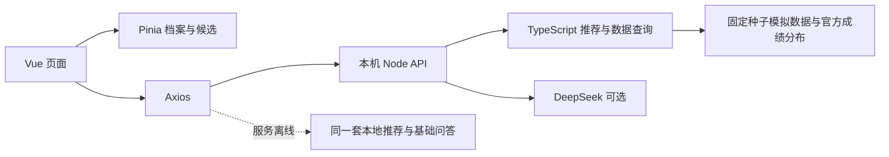

# 接口与后端职责

## 当前运行结构

浏览器请求 `/api`，开发服务器代理到 `127.0.0.1:3001`。示例服务只在本机监听；静态托管时采用明确标记的本地回退。公开部署真实 AI 前，需要鉴权、配额、成本控制和服务器配置，不能直接依靠当前本机示例。

## 推荐接口

`POST /api/recommendations`

请求为 `{ "profile": Profile }`，完整 Profile 示例见 README。省份、年份、成绩、选科、进阶开关和九项 0—10 整数档位在服务端重新校验；费用项启用且档位大于 0 时校验预算。所有启用项均为 0 或输入非法时返回 400。服务端用 preferences 与 advancedEnabled 换算权重，不接受客户端自行指定百分比。响应字段：

| 字段             | 含义                                           |
| ---------------- | ---------------------------------------------- |
| items            | 所有符合资格和意向专业条件的推荐，按匹配分排序 |
| total            | 推荐总数，可能少于 20；不会用无资格项目凑数    |
| elapsedMs        | 服务端计算耗时，不含网络和页面渲染             |
| source           | 当前为 simulated                               |
| algorithmVersion | 当前为 independent-preferences-v2                             |

每个推荐包含 `id / school / major / score / risk / riskReason / factors / reasons`。`factors` 保存九项评分、权重和贡献分。风险可为冲、稳、保或数据不足。实际产品建议新增数据版本、政策版本、更新日期、证据记录与置信度字段。

## 问答接口

`POST /api/chat`

请求为 `{ "profile": Profile, "messages": [{ "role": "user", "content": "上海平行志愿怎么投档？" }] }`。最多 12 条历史消息，每条最多 2000 字；只接受 user/assistant，最后一条必须为 user。响应为 `{ answer, mode, sources, category }`，mode 为 rules、deepseek 或 fallback，页面必须据此显示实际回答方式。

基础检索读取当前档案和对话中的学校、专业名称，再调用同一推荐函数。模型模式将检索结果交给 DeepSeek 整理；没有密钥就直接返回规则结果，模型异常则返回明确标记的基础回答。文本使用 Vue 插值渲染，不执行模型返回的 HTML。

当前规则系统支持有限关键词和上下文，不是完整语义检索。生产阶段需完善实体识别、数据查询工具、政策知识库、来源核验、越权与提示注入防护、回答质量评估。向外部模型发送真实考生信息前，还需明确用户授权与数据保留策略。

## 未来实体与关系

| 实体                         | 关键字段与关系                                                  |
| ---------------------------- | --------------------------------------------------------------- |
| School                       | 学校 ID、名称、地区、层次                                       |
| AdmissionGroup               | 学校 ID、省份、年度、批次、官方组代码、选科要求                 |
| MajorOffering                | 专业 ID、年度、专业组 ID、学制、学费、计划数、特殊限制          |
| ScoreDimension / ScoreRecord | 维度定义、实体 ID、原始指标、分数、年份、来源                   |
| AdmissionHistory             | 年份、批次、组或专业 ID、分数及位次区间、数据粒度、缺失原因     |
| EmploymentRecord             | 学校专业 ID、统计年份、岗位、去向、比例、薪资、样本量与统计口径 |
| CandidateProfile             | 考生成绩、选科、偏好、权重；登录后绑定用户                      |
| SavedPlan / PlanItem         | 方案版本、志愿组顺序、组内专业顺序、调剂选项                    |
| DataSource                   | 来源 URL、发布与抓取时间、校验状态、真实或模拟标记              |

原型为减少阅读负担，将专业组字段嵌入专业样本；正式数据库应独立建表，并以年度和批次参与唯一键。真实专业设置与收费不能从学校名称推断。

## 前后端分工

前端负责输入校验、进阶表单、加载与错误提示、偏好交互、结果解释、图表、对比和方案编辑。后端负责数据采集与更新、来源核查、参照完整性、正式推荐规则与版本、特殊报考条件校验、用户权限、方案持久化及模型调用。

未来接口应补充院校搜索、专业组与专业详情、维度配置、历史数据、方案保存与读取、政策查询。开发时先确定字段、空值、单位、数据年份和错误码，再替换 `src/services/api.ts`，避免让每个页面分别适配后端返回格式。

## 错误与安全边界

本机服务返回 400（输入错误）、403（不允许的来源）、404（接口不存在）、413（请求体过大）、429（模型限流）和 500（服务异常）。请求体最多 32 KiB。密钥不进入浏览器、响应或日志。当前每分钟和并发限制是进程内计数，重启会清空，不能替代生产鉴权和用户配额。
